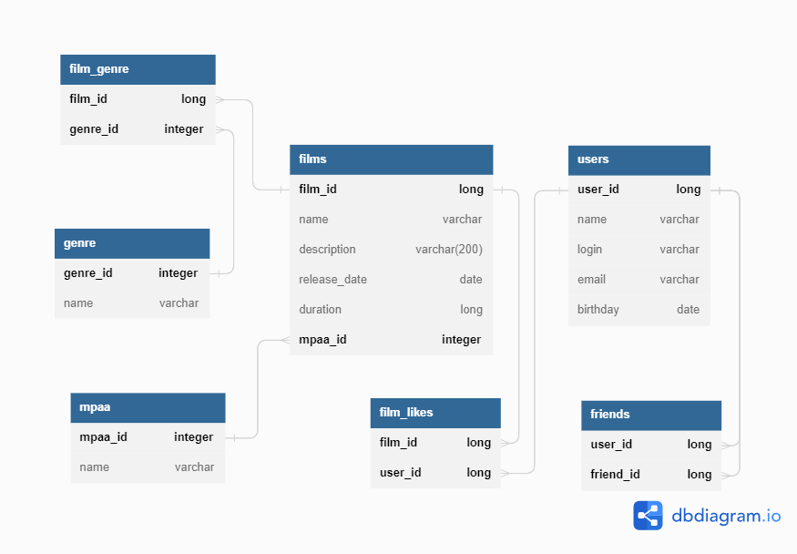

## Модуль №3 java-filmorate

_Бэкенд для сервиса, который будет работать с фильмами и оценками пользователей, а также возвращать топ лучших фильмов,
рекомендованных к просмотру._


<details>
  <summary>Спринт 9</summary> 

1. Модели данных — Film и User
2. Хранение данных в памяти приложения
3. REST-контроллеры: FilmController будет обслуживать фильмы, а UserController — пользователей.
4. Валидация данных, которые приходят в запросе на добавление нового фильма или пользователя. Проверяется тестами Unit5
5. Логирование

</details>

<details>
  <summary>Спринт 10</summary> 

1. Архитектура и новая логика проекта:
   интерфейсы FilmStorage и UserStorage, классы InMemoryFilmStorage и InMemoryUserStorage,
   классы UserService и FilmService.
2. Зависимости -> @Service, @Component, @Autowired
3. API -> соответствие REST
4. ExceptionHandler для централизованной обработки ошибок

</details>  

<details>
  <summary>Спринт 11: Промежуточное ТЗ</summary>

1. Проектирование базы данных, создание схемы
2. Примеры запросов для основных операций приложения.

</details>

<details>
  <summary>Спринт 11: Итоговое ТЗ</summary> 

1. ...
2. ...

</details>

### ER диаграмма базы данных и примеры запросов



---

<details>
  <summary>Получение списка всех фильмов</summary> 

```sql
SELECT * 
FROM films;
```

</details>  


<details>
  <summary>Получение списка фильмов, вышедших в определенном году</summary>

```sql
  SELECT f.name, f.release_year 
  FROM films f 
  WHERE f.release_year = 2020;
```

</details>  

<details>
  <summary>Получение списка друзей для заданного пользователя</summary>

```sql
  SELECT us.name 
  FROM friends fr 
  INNER JOIN users us ON us.user_id = fr.friend_id 
  WHERE fr.user_id = 12;
```

</details>  

<details>
  <summary>Получение списка фильмов определенного жанра</summary>

```sql
  SELECT f.name AS title, f.release_year, g.name AS genre
  FROM films f
  INNER JOIN film_genre fg ON fg.film_id = f.film_id
  INNER JOIN genre g ON g.genre_id = fg.genre_id
  WHERE g.name = 'Комедия';
```

</details>  


