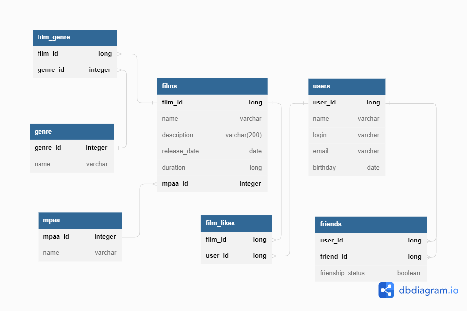

## Модуль №3 java-filmorate

_Бэкенд для сервиса, который будет работать с фильмами и оценками пользователей, а также возвращать топ лучших фильмов,
рекомендованных к просмотру._


<details>
  <summary>Спринт 9</summary> 

1. Модели данных — Film и User
2. Хранение данных в памяти приложения
3. REST-контроллеры: FilmController будет обслуживать фильмы, а UserController — пользователей.
4. Валидация данных, которые приходят в запросе на добавление нового фильма или пользователя. Проверяется тестами Unit5
5. Логирование

</details>

<details>
  <summary>Спринт 10</summary> 

1. Архитектура и новая логика проекта:
   интерфейсы FilmStorage и UserStorage, классы InMemoryFilmStorage и InMemoryUserStorage,
   классы UserService и FilmService.
2. Зависимости -> @Service, @Component, @Autowired
3. API -> соответствие REST
4. ExceptionHandler для централизованной обработки ошибок

</details>  

<details>
  <summary>Спринт 11: Промежуточное ТЗ</summary>

1. Проектирование базы данных, создание схемы
2. Примеры запросов для основных операций приложения.

</details>

<details>
  <summary>Спринт 11: Итоговое ТЗ</summary> 

1. ...
2. ...

</details>

### ER диаграмма базы данных и примеры запросов



---

<details>
  <summary>Получение списка всех фильмов</summary> 

```sql
SELECT * 
FROM films;
```

</details>

<details>
  <summary>Запрос на вывод фильма по id</summary> 

```sql
SELECT * 
FROM films 
WHERE film_id = <id> 
```

</details>  

<details>
  <summary>Вывод 10 самых популярных фильмов</summary> 

```sql
SELECT films.film_id, 
films.name, 
COUNT(*) as likes_count 
FROM film_likes JOIN films ON film_likes.film_id = films.film_id 
GROUP BY films.film_id, films.name 
ORDER BY likes_count DESC
LIMIT 10;
```

</details>  

<details>
  <summary>Запрос на вывод всех пользователей</summary> 

```sql
SELECT * 
FROM users;
```

</details>  

<details>
  <summary>Вывод пользователя по id</summary> 

```sql
SELECT * 
FROM users 
WHERE user_id = <id>;
```
</details> 

<details>
  <summary>Вывод всех друзей определенного пользователя</summary> 

```sql
SELECT users.name, friends.friend_id, friends.frienship_status
FROM friends JOIN users ON friends.friend_id = users.user_id 
WHERE friends.user_id = <user_id>;
-- <user_id> - это значение id пользователя, для которого мы хотели бы получить его друзей.
```

</details>  

<details>
  <summary>Вывод общих друзей для двух пользователей (например, с id 1 и 2)</summary> 

```sql
SELECT f1.friend_id 
FROM friends f1 JOIN friends f2 ON f1.friend_id = f2.friend_id 
WHERE f1.user_id = 1 
AND f2.user_id = 2;
```

</details>

<details>
  <summary>Получение списка фильмов, вышедших в определенном году</summary>

```sql
  SELECT f.name, 
  EXTRACT(YEAR FROM f.release_date) AS release_year,
  FROM films f 
  WHERE f.release_year = 2020;
```

</details>  

<details>
  <summary>Получение списка друзей для заданного пользователя</summary>

```sql
  SELECT us.name 
  FROM friends fr 
  INNER JOIN users us ON us.user_id = fr.friend_id 
  WHERE fr.user_id = 12;
```

</details>  

<details>
  <summary>Получение списка фильмов определенного жанра</summary>

```sql
  SELECT f.name AS title, 
  EXTRACT(YEAR FROM f.release_date) AS release_year, 
  g.name AS genre
  FROM films f
  INNER JOIN film_genre fg ON fg.film_id = f.film_id
  INNER JOIN genre g ON g.genre_id = fg.genre_id
  WHERE g.name = 'Комедия';
```

</details>  

<details>
  <summary>Количество пользователей, у которых день рождения сегодня</summary>

```sql
  SELECT COUNT(user_id) 
  FROM users 
  WHERE EXTRACT(DAY FROM birthday) = EXTRACT(DAY FROM NOW())
  AND EXTRACT(MONTH FROM birthday) = EXTRACT(MONTH FROM NOW());
```

</details>  


